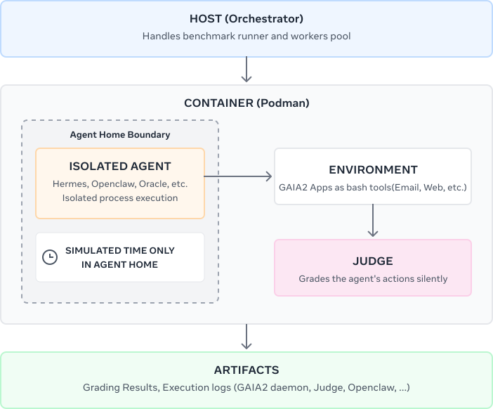
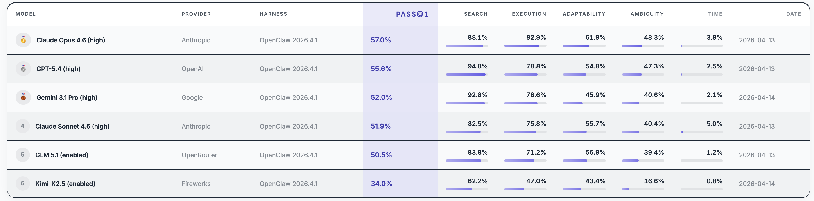

# Gaia2-CLI: Evaluating Agentic Systems in Real Execution Environments


[Gaia2](https://arxiv.org/abs/2602.11964) is a general-purpose agent evaluation benchmark built on the [ARE framework](https://arxiv.org/abs/2509.17158). It evaluates agents across 800 scenarios involving 10 interconnected applications — messaging, calendar, email, contacts, shopping, file system, and more — in an environment that evolves asynchronously from the agent's own actions, with notifications arriving and time flowing independently. For full details on the benchmark design, see the [Gaia2 paper](https://arxiv.org/abs/2602.11964) and our [previous blog post](https://huggingface.co/blog/gaia2).

Since then, the agent landscape has shifted. A new generation of agentic systems — [OpenClaw](https://github.com/openclaw-ai/openclaw), [Hermes-Agent](https://github.com/NousResearch/hermes-agent), and others — has moved beyond structured tool calling toward direct terminal interaction: writing code, navigating file systems, composing shell commands in real execution environments. This is the next frontier of practical agents, and evaluation needs to keep up.

**Gaia2-CLI is our update to Gaia2 with first-class support for this mode of orchestration.**

## From Tool Calling to Terminal Interaction

The original Gaia2 evaluation relied on agents interacting with benchmark applications through structured API tool calls. Gaia2-CLI takes a fundamentally different approach: it gives the agent **a terminal.**

The entire benchmark runs inside containers. Each agent gets its own isolated environment with a home directory, a full CLI, and access to all Gaia2 applications through command-line interfaces. There is no scaffold to build and no API layer to integrate — the agent interacts with the benchmark the way a user interacts with a workstation.

This design choice reflects where the field has moved. Modern agentic frameworks such as [OpenClaw](https://github.com/openclaw-ai/openclaw) and [Hermes-Agent](https://github.com/NousResearch/hermes-agent) are built around direct terminal interaction — executing code, navigating file systems, composing shell commands. Gaia2-CLI evaluates these systems in their native mode of operation rather than forcing them through an intermediary abstraction.


*High-level architecture: the host orchestrator launches containerized agent runtimes, each with access to Gaia2 app CLIs, a shared HTTP contract, and automatic grading against the scenario oracle.*

## What Agents Actually Do

The shift from tool calling to terminal access fundamentally changes how agents approach tasks. Rather than selecting from a fixed set of API functions, they compose solutions using the full expressiveness of a shell environment.

Here is Claude Opus 4.6 searching through a cloud drive for a specific document using bash piping:

```bash
$ for f in $(cloud-drive ls --path /Documents/news | tr -d '[]," '); do
  content=$(cloud-drive cat --path "$f" 2>/dev/null);
  if echo "$content" | grep -qi "Copa Am"; then
    echo "FOUND: $f";
  fi;
done
```

And here it is orchestrating a contact search with inline Python, paginating through results and filtering by job title:

```python
$ python3 -c "import subprocess, json
librarians = []
offset = 0
while True:
    result = subprocess.run(['contacts', 'get-contacts', '--offset', str(offset)],
        capture_output=True, text=True)
    data = json.loads(result.stdout)
    contacts = data.get('contacts', [])
    if not contacts: break
    for c in contacts:
        job = (c.get('job') or '').lower()
        if 'librarian' in job:
            librarians.append(c)
    offset += len(contacts)
for c in librarians:
    print(json.dumps({'name': c['first_name'] + ' ' + c['last_name'], 'job': c['job']}))
print('TOTAL:', len(librarians))"
```

None of this is possible with structured tool calling. The agent decides *how* to search, *how* to filter, and *how* to combine tools — using standard programming constructs rather than predefined API schemas. This is closer to how humans actually use computers, and it surfaces capabilities (and failure modes) that API-based evaluation cannot reach.

## Getting Started

Gaia2-CLI is model-agnostic — we ship ready-made configurations for Anthropic, OpenAI, Google, and templates for any OpenAI-compatible endpoint. The [dataset](https://huggingface.co/datasets/meta-agents-research-environments/gaia2-cli) is fetched automatically from Hugging Face. Every run produces structured traces (tool calls, model reasoning, timing metrics) inspectable through a built-in trace viewer. See the [quickstart guide](https://github.com/facebookresearch/meta-agents-research-environments/tree/main/gaia2-cli) for setup instructions.

## First Results

We evaluated six models on Gaia2-CLI using the OpenClaw runtime. The results reveal clear capability stratification, particularly on tasks requiring adaptability, ambiguity resolution, and temporal reasoning.



Several observations stand out:

- **Search is largely solved** — top models exceed 88% on retrieval tasks, confirming that web search and information lookup are no longer meaningful differentiators.
- **Time-sensitive tasks remain extremely hard** — no model exceeds 5% on temporal reasoning scenarios. These tasks require agents to take precisely timed actions in response to environment changes and notifications (e.g., ordering a cab exactly 3 minutes after an event ends, or reacting to a schedule update that arrived while another action was in progress). Success demands a combination of temporal awareness, action timing, and the ability to interleave reactive and proactive behavior — a capability gap that current agentic systems have yet to close.
- **Ambiguity is the next frontier** — the gap between search (88–95%) and ambiguity (40–48%) for leading models highlights how poorly agents handle conflicting or underspecified instructions.
- **Adaptability separates tiers** — Claude Opus leads overall largely because of its 61.9% adaptability score, suggesting that recovering from failures and adjusting plans mid-execution is where model scale currently pays off.

All results are tracked on the [Gaia2 Leaderboard](https://huggingface.co/spaces/meta-agents-research-environments/leaderboard), which accepts submissions from both the original ARE-based evaluation and the new Gaia2-CLI stack. We encourage the community to submit results with additional runtimes, models, and configurations.

## Conclusion

We will be presenting Gaia2 at **ICLR 2026 — Oral Session 3A, Amphitheater, Friday April 25 at 10:30 AM**. Come say hi!

Gaia2-CLI is available now at [github.com/facebookresearch/meta-agents-research-environments/tree/main/gaia2-cli](https://github.com/facebookresearch/meta-agents-research-environments/tree/main/gaia2-cli). We welcome submissions to the [leaderboard](https://huggingface.co/spaces/meta-agents-research-environments/leaderboard) and feedback via [GitHub issues](https://github.com/facebookresearch/meta-agents-research-environments/issues).

## Links

- 📦 **Gaia2-CLI**: [github.com/.../gaia2-cli](https://github.com/facebookresearch/meta-agents-research-environments/tree/main/gaia2-cli)
- 📄 **Gaia2 Paper**: [arxiv.org/abs/2602.11964](https://arxiv.org/abs/2602.11964)
- 📄 **ARE Paper**: [arxiv.org/abs/2509.17158](https://arxiv.org/abs/2509.17158)
- 🏆 **Leaderboard**: [huggingface.co/spaces/.../leaderboard](https://huggingface.co/spaces/meta-agents-research-environments/leaderboard)
- 📊 **Dataset**: [huggingface.co/datasets/.../gaia2-cli](https://huggingface.co/datasets/meta-agents-research-environments/gaia2-cli)

## Citation

```bibtex
@misc{froger2026gaia2,
  title={Gaia2: Benchmarking LLM Agents on Dynamic and Asynchronous Environments},
  author={Romain Froger and Pierre Andrews and Matteo Bettini and Amar Budhiraja and Ricardo Silveira Cabral and Virginie Do and Emilien Garreau and Jean-Baptiste Gaya and Hugo Laurençon and Maxime Lecanu and Kunal Malkan and Dheeraj Mekala and Pierre Ménard and Gerard Moreno-Torres Bertran and Ulyana Piterbarg and Mikhail Plekhanov and Mathieu Rita and Andrey Rusakov and Vladislav Vorotilov and Mengjue Wang and Ian Yu and Amine Benhalloum and Grégoire Mialon and Thomas Scialom},
  year={2026},
  eprint={2602.11964},
  archivePrefix={arXiv}
}
```
